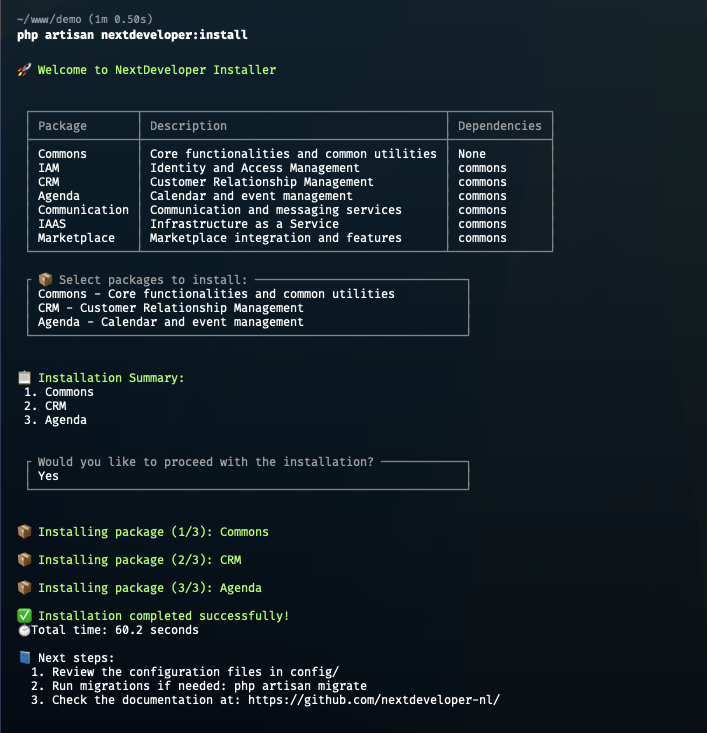

# NextDeveloper Installer

This comprehensive installer simplifies the process of setting up NextDeveloper packages, making it easier than ever to install and configure packages with minimal effort.



## Features

- 🎯 Interactive package selection
- 🔄 Automatic dependency resolution
- 🛠️ Automatic configuration publishing
- 🔒 System requirements verification

## Prerequisites

Before you start, ensure the following prerequisites are fulfilled:

- **PHP**: Version 8.0 or higher
- **Laravel**: Version 8.x or higher
- **Composer**: Latest stable version

## Installation

To install the package, use Composer by running this command:

```bash
composer require nextdeveloper/installer
```

## Usage

1. Launch the installer using:

```bash
php artisan nextdeveloper:install
```

2. Follow the interactive prompts:
   - Select desired packages from the list
   - Review and confirm dependencies
   - Monitor installation progress

The installer will automatically:

- Verify system requirements
- Install selected packages
- Publish configurations
- Set up database migrations
- Configure service providers

## Support

For support and questions:
- GitHub Issues : [https://github.com/nextdeveloper-nl/installer/issues](https://github.com/nextdeveloper-nl/installer/issues)
- Documentation: [https://github.com/nextdeveloper-nl/](https://github.com/nextdeveloper-nl/)

## Contributing

Contributions are welcome! Please feel free to submit a Pull Request. For major changes, please open an issue first to discuss what you would like to change.

## License

This project is licensed under the MIT License - see the [LICENSE](LICENSE) file for details.

